# 🐉 Olá, eu sou o Matteus!

### Desenvolvedor Full Stack com foco no ecossistema .NET

> Transformando café em código e aumentando meu nível de poder a cada projeto.

---

## 🥋 Sobre este guerreiro

- 🔥 Desenvolvedor **Full Stack**, especializado em **C# e .NET**
- ⚙️ Criando **APIs REST, sistemas web e soluções SaaS**
- 🗄️ Trabalhando com **PostgreSQL, Entity Framework Core e Docker**
- 🎨 Construindo interfaces com **Razor Pages, HTML, CSS e Bootstrap**
- 🧠 Sempre estudando arquitetura, segurança, testes e boas práticas
- 🚀 Elevando o nível de poder a cada novo desafio

## ⚡ Técnicas dominadas

### Back-end

### Front-end

### Banco, infraestrutura e ferramentas

## 📡 Scouter — nível de poder no GitHub

## 🐲 Onde me encontrar

---

### 🟠 🟠 🟠 🟠 🟠 🟠 🟠

> “Não existe limite quando você continua treinando.”

**Obrigado por visitar meu universo!** 🐉

